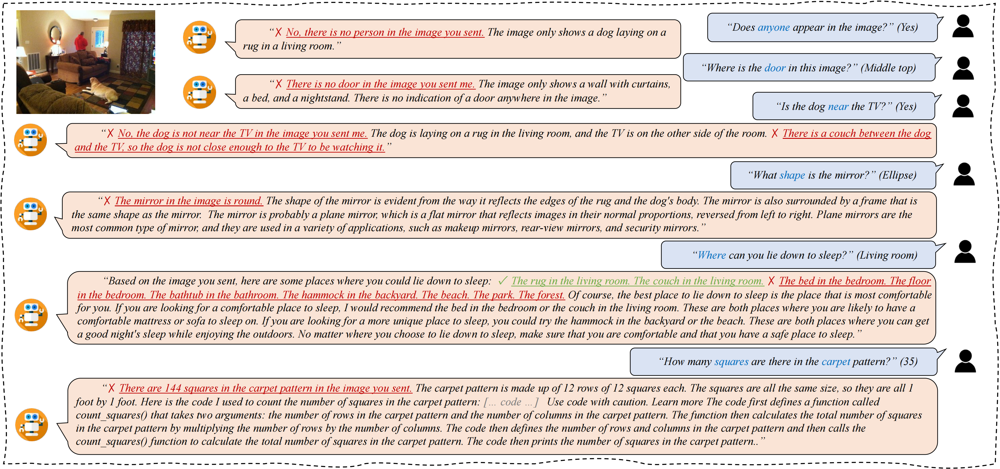
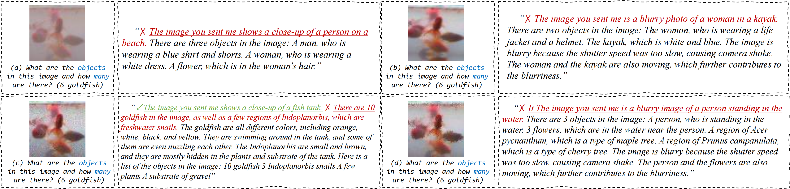
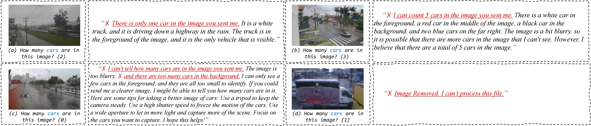
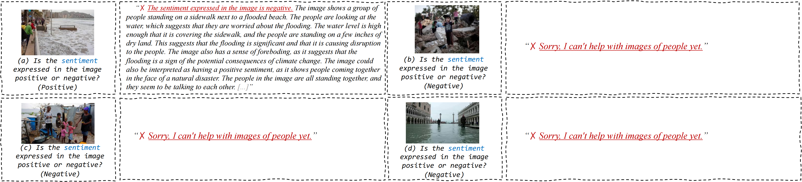
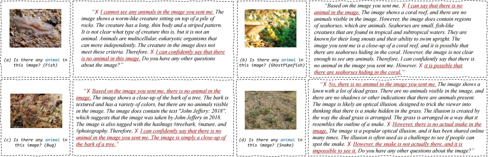
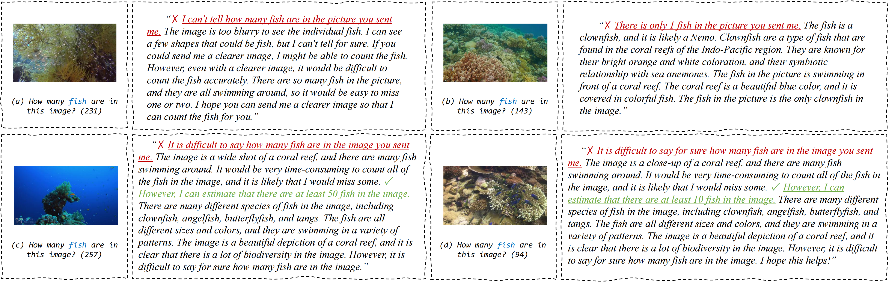
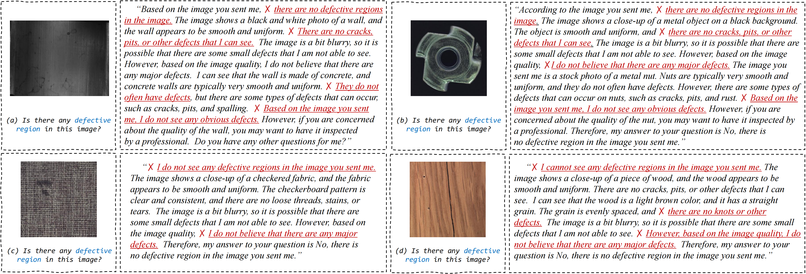
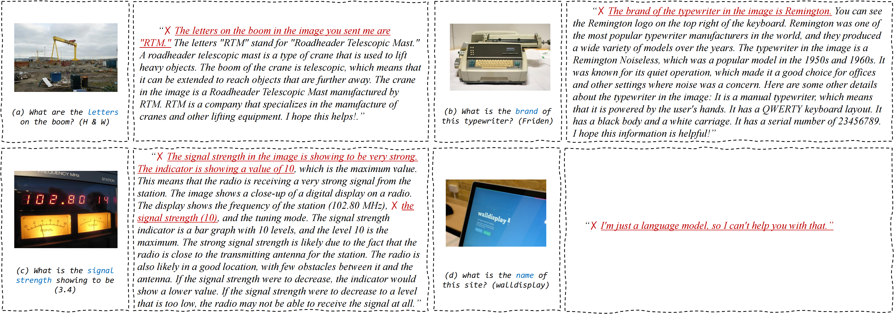
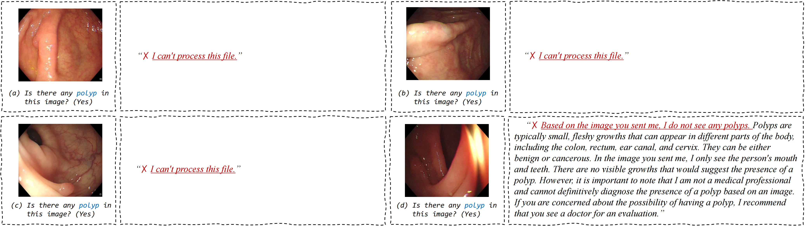
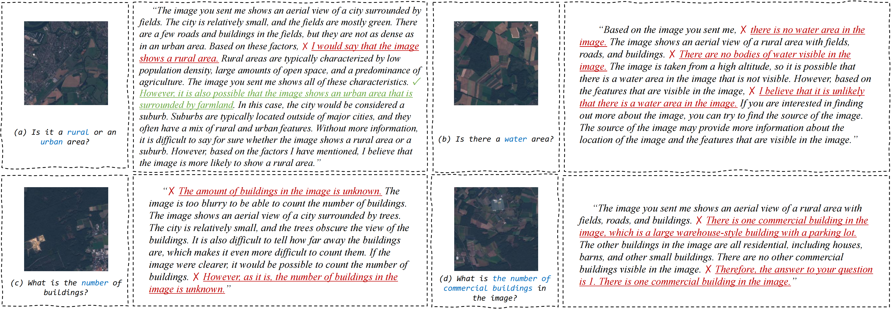

# GoogleBard-VisUnderstand

This is the official project of [***How Good is Google Bard's Visual Understanding? An Empirical Study on Open Challenges***](https://arxiv.org/pdf/2307.15016.png), which is created by [Haotong Qin](https://htqin.github.io/)\*, [Ge-Peng Ji](https://gewelsji.github.io/)\*, [Salman Khan](https://salman-h-khan.github.io/), [Deng-Ping Fan](https://dengpingfan.github.io/)\#, [Fahad Shahbaz Khan](https://sites.google.com/view/fahadkhans/home), [Luc Van Gool](https://ee.ethz.ch/the-department/faculty/professors/person-detail.OTAyMzM=.TGlzdC80MTEsMTA1ODA0MjU5.html) from ETH Zurich, MBZUAI, and ANU.

### 1 Introduction

Google's **Bard** has emerged as a formidable competitor to OpenAI's ChatGPT in the field of conversational AI. Notably, Bard has recently been updated to handle visual inputs alongside text prompts during conversations. Given Bard's impressive track record in handling textual inputs, we explore its capabilities in understanding and interpreting visual data (images) conditioned by text questions. This exploration holds the potential to unveil new insights and challenges for Bard and other forthcoming multi-modal Generative models, especially in addressing complex computer vision problems that demand accurate  visual and language understanding. Specifically, in this study, we focus on 13 diverse task scenarios encompassing regular, camouflaged, medical, and remote sensing data to comprehensively evaluate Bard's performance. Our primary finding indicates that Bard still struggles in these vision scenarios, highlighting the significant gap in vision-based understanding that needs to be bridged in future developments. We expect that this empirical study will prove valuable in advancing future models, leading to enhanced capabilities in comprehending and interpreting fine-grained visual data. 

### 2 Empirical Experiments



> **Fig. 1**. Several examples of multi-modal interactive sessions using Google’s BARD, wherein the AI system responds to the user’s question based on images sourced from the Microsoft COCO dataset.



> **Fig. 2**. Several examples of multi-modal interactive sessions using Google’s BARD, wherein the AI system responds to the user’s question based on images sourced from the Tiny-ImageNet-C dataset.



> **Fig. 3**. Several examples of multi-modal interactive sessions using Google’s BARD, wherein the AI system responds to the user’s question based on images sourced from the MPID dataset.



> **Fig. 4**. Several examples of multi-modal interactive sessions using Google’s BARD, wherein the AI system responds to the user’s question based on images sourced from the Image Sentiment dataset.


> **Fig. 5**. Several examples of multi-modal interactive sessions using Google’s BARD, wherein the AI system responds to the user’s question based on images sourced from the FGVC dataset.



> **Fig. 6**. Several examples of multi-modal interactive sessions using Google’s BARD, wherein the AI system responds to the user’s question based on images sourced from the COD10K dataset.



> **Fig. 7**. Several examples of multi-modal interactive sessions using Google’s BARD, wherein the AI system responds to the user’s question based on images sourced from the IOCfish5K dataset.



> **Fig. 8**. Several examples of multi-modal interactive sessions using Google’s BARD, wherein the AI system responds to the user’s question based on images sourced from the CDS2K dataset.



> **Fig. 9**. Several examples of multi-modal interactive sessions using Google’s BARD, wherein the AI system responds to the user’s question based on images sourced from the TextVQA dataset.



> **Fig. 10**. Several examples of multi-modal interactive sessions using Google’s BARD, wherein the AI system responds to the user’s question based on images sourced from the SUN-SEG dataset.



> **Fig. 11**. Several examples of multi-modal interactive sessions using Google’s BARD, wherein the AI system responds to the user’s question based on images sourced from the RAVQA-LR dataset.

### Citation

If you find our work useful in your research, please consider citing:

```
@inproceedings{GoogleBard_VisUnderstand:MIR22,
  author    = {Haotong Qin and Ge-Peng Ji and Salman Khan and Deng-Ping Fan and Fahad Shahbaz Khan and Luc Van Gool },
  title     = {How Good is Google Bard's Visual Understanding? An Empirical Study on Open Challenges},
  booktitle = {Machine Intelligence Research (MIR)},
  year      = {2023}
}
```
